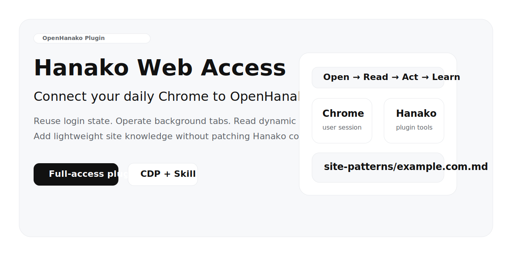
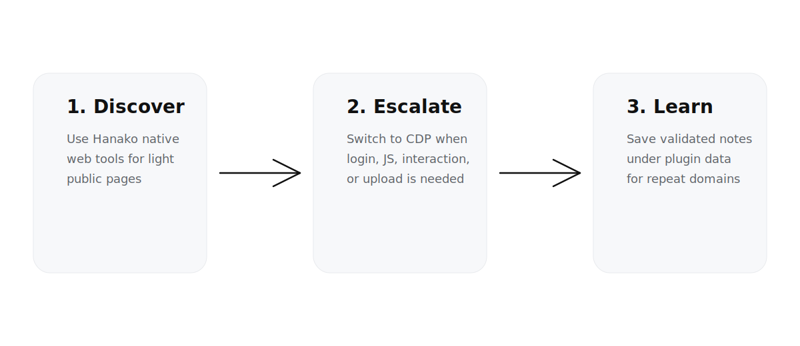

<p align="center">
  
</p>

<h1 align="center">Hanako Web Access</h1>

<p align="center">把日常 Chrome 真正接进 OpenHanako</p>

<p align="center">
  <a href="https://github.com/huanyu16/hanako-web-access">GitHub</a> ·
  <a href="https://huanyu16.github.io/hanako-web-access/">介绍页</a>
</p>

> 不是给 Agent 再开一个独立浏览器实例。是让 Hanako 直接连接你平时正在用的 Chrome，复用登录态，在后台标签页里完成真实网页任务。

## 为什么值得装

很多 Agent 的浏览器能力，不是不能点网页，而是**接入的浏览器环境不对**。

- 独立浏览器实例：隔离是隔离了，但登录态断了
- Search / Fetch：查静态网页够用，但遇到登录态和 JS 重页面就天然失效
- 复杂站点：真正需要的是进入用户现有 Chrome，在后台标签页里把事情做完

这个插件干的就是这件事。

## 这是什么

`hanako-web-access` 是一个 **OpenHanako full-access 插件**。它吸收了 [`eze-is/web-access`](https://github.com/eze-is/web-access) 的核心思路，但不是生硬移植 Claude Code 版 skill，而是按 Hanako 的插件体系重新组织：

- 用 `skills/` 注入浏览策略
- 用 `tools/` 暴露浏览器能力
- 用插件私有 `dataDir` 存储站点经验
- 用插件自身的 CDP proxy 连接用户现有 Chrome

## 一眼看懂工作方式

<p align="center">
  
</p>

## 它解决什么问题

Hanako 原生的轻量 web 能力适合：
- 搜索官网
- 读静态网页
- 快速事实核对

但下面这些任务，往往不是 Search / Fetch 能解决的：
- 需要登录态的网站
- JS 重页面
- 内容平台站内搜索
- 点击、输入、上传、发布
- 需要复用用户日常 Chrome 环境的页面

这就是这个插件存在的意义。

## 主要能力

- 连接用户现有 Chrome（CDP）
- 新建后台 tab
- 读取页面文本
- 执行 JS
- 点击 / 输入 / 滚动
- 截图
- 文件上传
- 关闭插件自己创建的 tab
- 站点经验按域名沉淀

## 最小示例

对 Agent 说：

```text
遵循 web-access skill，打开 https://example.com ，读取页面标题和正文摘要，完成后关闭标签页。
```

更复杂一点：

```text
遵循 web-access skill，直接用 Chrome 工具进入目标网站，不要先在静态工具上反复试错。优先在后台 tab 中完成站内搜索、读取正文、必要时截图，任务完成后关闭标签页。
```

## 安全边界

默认只操作**插件自己创建的 tab**。

也就是说：
- 不主动碰用户已有标签页
- 不关闭用户已有标签页
- 先把风险边界收紧，再谈自动化

如果你确实需要越过这个边界，可以在插件配置里显式打开，但默认不建议。

## 安装前准备

1. 打开 Chrome
2. 访问 `chrome://inspect/#remote-debugging`
3. 勾选 **Allow remote debugging for this browser instance**
4. 如有授权弹窗，点击允许

推荐 Node.js 22+。

## 安装方式

### 方式一：Hanako 内直接安装

- 打开 Hanako → 设置 → 插件
- 拖入本插件目录或 zip 包
- 开启 full-access 插件权限

### 方式二：手动放入插件目录

```bash
mkdir -p ~/.hanako/plugins/hanako-web-access
rsync -a ./ ~/.hanako/plugins/hanako-web-access/
```

然后重启 Hanako。

## 可用工具

- `hanako-web-access_chrome_open_tab`
- `hanako-web-access_chrome_list_tabs`
- `hanako-web-access_chrome_read_page`
- `hanako-web-access_chrome_eval`
- `hanako-web-access_chrome_click`
- `hanako-web-access_chrome_type`
- `hanako-web-access_chrome_scroll`
- `hanako-web-access_chrome_screenshot`
- `hanako-web-access_chrome_upload_files`
- `hanako-web-access_chrome_close_tab`
- `hanako-web-access_chrome_get_site_pattern`
- `hanako-web-access_chrome_list_site_patterns`

## 站点经验沉淀

插件会在成功读取站点后，按域名写入轻量经验文件，保存到：

```text
~/.hanako/plugin-data/hanako-web-access/site-patterns/
```

当前策略是保守的：
- 只写经过验证的成功事实
- 不写没有验证的猜测
- 把经验当提示，不当真理

## 适合什么 / 不适合什么

| 场景 | 建议 |
|---|---|
| 官网、文档、博客、公开静态页 | 优先 Hanako 原生 web 工具 |
| 登录态页面、JS 重页面 | 切到本插件 |
| 站内搜索、点击、上传、发布 | 切到本插件 |
| 轻量事实查询 | 不要过度上浏览器 |

## FAQ

### 1. 为什么不直接改 Hanako 内核？
因为 Hanako 更新很快。直接修改内核，短期省事，长期一定变成维护负担。插件化接入可以把维护面收缩到插件本身。

### 2. 这个插件会不会抢我浏览器控制权？
默认不会。它只操作自己创建的标签页，不碰你原有标签页。

### 3. 它会取代 Hanako 原生 web 工具吗？
不会。它是更重的一档。静态网页继续用原生工具，复杂网页再升级到本插件。

## 项目结构

```text
hanako-web-access/
├── manifest.json
├── index.js
├── tools/
├── skills/
├── lib/
└── docs/
```

## 介绍页

- `docs/index.html`
- GitHub Pages：<https://huanyu16.github.io/hanako-web-access/>

## License

MIT

本项目包含基于 [`web-access`](https://github.com/eze-is/web-access) 的适配与再组织，保留原项目署名与许可信息。
